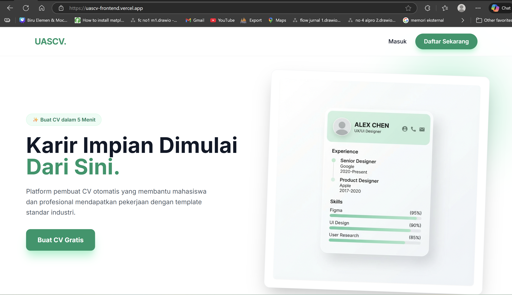
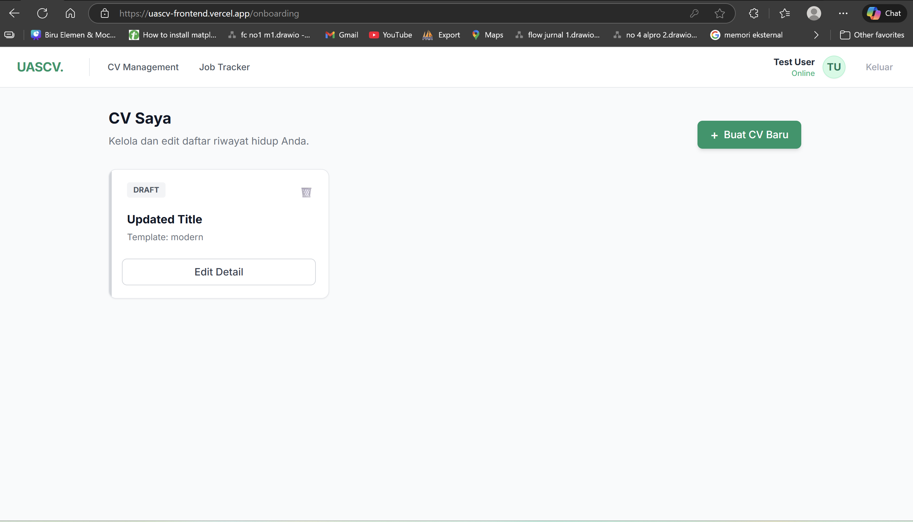
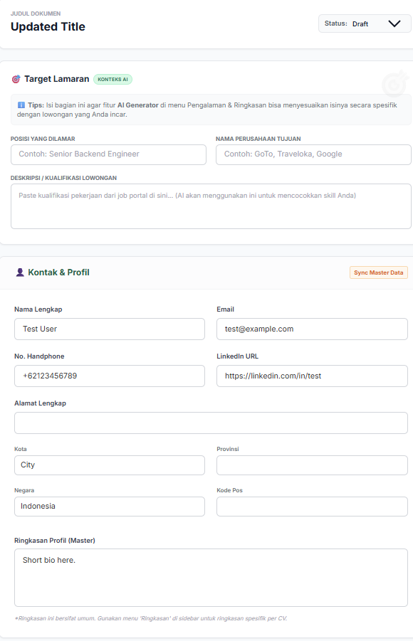
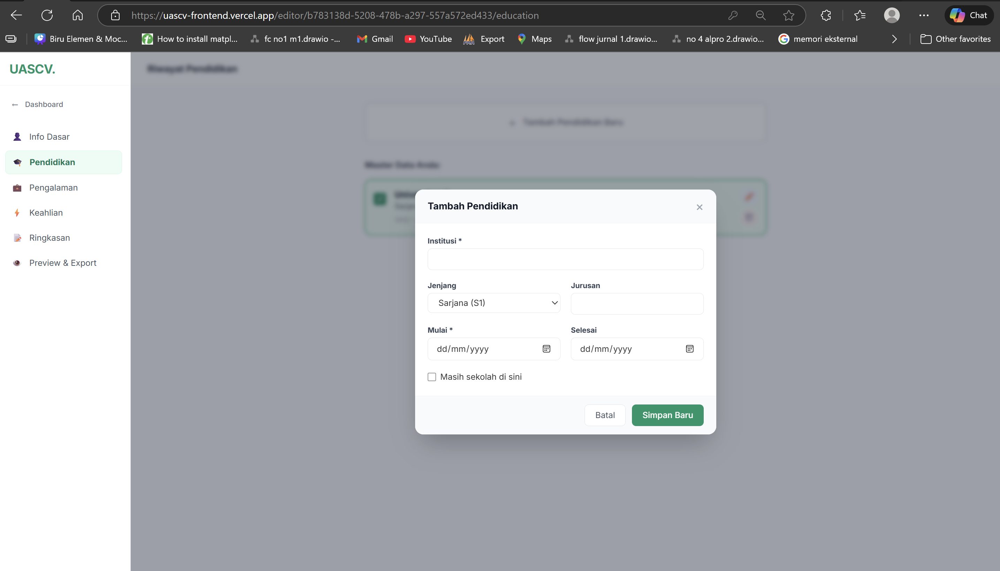
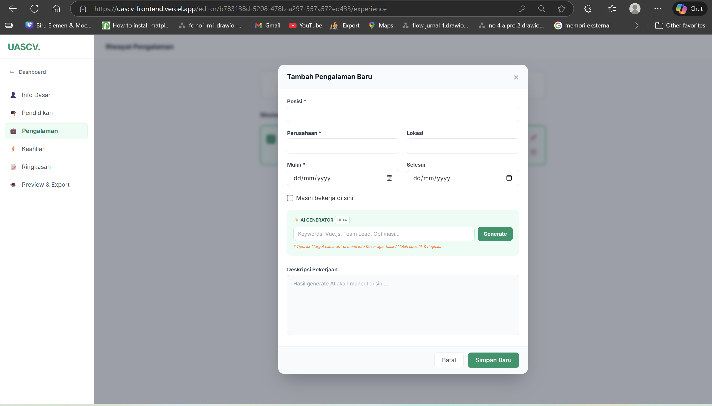
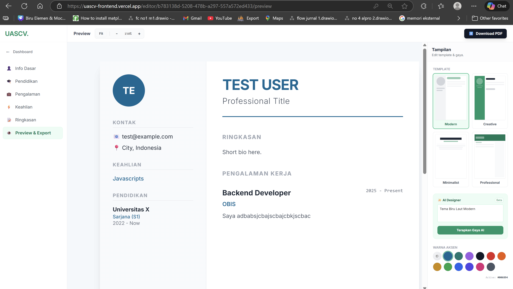
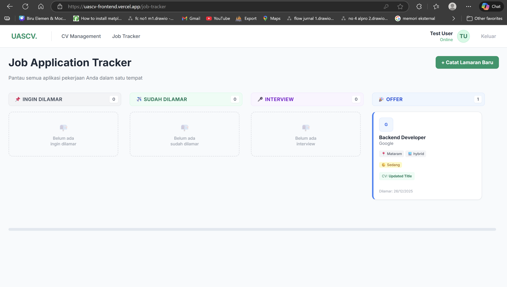

# 🚀 AI CV Maker (UASCV)

Aplikasi pembuat CV otomatis berbasis AI yang membantu mahasiswa dan profesional membuat CV standar industri dalam hitungan menit.



---

## 📋 Daftar Isi
1. [Fitur Utama](#-fitur-utama)
2. [Prasyarat](#-prasyarat)
3. [Cara Menjalankan (Quick Start)](#-cara-menjalankan-quick-start)
4. [Daftar Endpoint API](#-daftar-endpoint-api)
5. [Database ERD](#-database-erd)
6. [Galeri Screenshot](#-galeri-screenshot)

---

## ✨ Fitur Utama
- **AI-Powered**: Generate deskripsi pekerjaan, ringkasan profesional, dan style CV menggunakan Gemini AI.
- **Real-time Preview**: Lihat perubahan CV secara langsung saat diedit.
- **Multiple Templates**: Pilihan template Modern, Creative, Minimalist, dan Professional.
- **Job Tracker**: Pantau status lamaran kerja (Wishlist, Applied, Interview, Offer).
- **PDF Export**: Download CV berkualitas tinggi siap cetak (A4).

---

## 📋 Prasyarat
Pastikan sudah terinstall:
- **Node.js** (v16+)
- **NPM**
- **Git**
- **PostgreSQL** (via Supabase)

---

## ⚡ Cara Menjalankan (Quick Start)

### 1. Setup Backend
Backend berjalan di Port `3000`.

```bash
# Masuk ke folder backend
cd backend

# Install dependencies
npm install

# Buat file .env (minta ke ketua tim/lihat contoh)
# Pastikan konfigurasi SUPABASE dan GEMINI_TOKEN sudah benar

# Jalankan server
npm run dev
```

### 2. Setup Frontend
Frontend berjalan di Port `5173`.

```bash
# Buka terminal baru, masuk ke folder frontend
cd frontend

# Install dependencies
npm install

# Jalankan development server
npm run dev
```

Aces aplikasi di: `http://localhost:5173`

---

## 🔌 Daftar Endpoint API
Base URL: `http://localhost:3000/api`

### 1. Authentication
*   `POST /auth/register` - Daftar akun baru
*   `POST /auth/login` - Login user

### 2. CV Management
*   `GET /cvs` - Ambil semua CV user
*   `POST /cvs` - Buat CV baru
*   `GET /cvs/:id/full` - Ambil data lengkap CV
*   `PUT /cvs/:id` - Update data CV
*   `POST /cvs/:id/toggle` - Link/Unlink item ke CV

### 3. Master Data (Profile Items)
*   `GET/POST/PUT/DELETE /master/educations` - CRUD Pendidikan
*   `GET/POST/PUT/DELETE /master/experiences` - CRUD Pengalaman
*   `GET/POST/PUT/DELETE /master/skills` - CRUD Skill

### 4. Job Tracker
*   `GET /job-tracker` - List semua lamaran
*   `POST /job-tracker` - Tambah lamaran baru
*   `PATCH /job-tracker/:id/status` - Update status lamaran
*   `GET /job-tracker/stats` - Statistik lamaran

### 5. AI Features
*   `POST /ai/experience` - Generate deskripsi pengalaman kerja
*   `POST /ai/summary` - Generate summary profile

---

## 🗄️ Database ERD
Struktur database relasional yang digunakan dalam aplikasi ini.


---

## 📸 Galeri Screenshot

### 1. Halaman Utama (Landing Page)
Halaman depan yang menyambut pengguna dengan desain modern dan informatif. Menampilkan ringkasan fitur unggulan aplikasi seperti pembuatan CV dengan AI dan berbagai pilihan template menarik. Terdapat tombol akses cepat untuk mendaftar atau masuk ke dalam akun pengguna.


### 2. Onboarding & Dashboard
Halaman utama setelah login berfungsi sebagai pusat kontrol pengguna. Di sini, Anda dapat melihat daftar riwayat hidup (CV) yang telah dibuat, status terakhirnya, dan tombol untuk membuat CV baru. Halaman ini dirancang agar pengguna dapat dengan mudah mengelola banyak versi CV untuk berbagai lamaran kerja.


### 3. Info Dasar (Basic Details)
Formulir pengisian data diri utama yang menjadi fondasi dari setiap CV. Pengguna dapat melengkapi informasi vital seperti Nama Lengkap, Email, Nomor Telepon, dan Tautan LinkedIn. Data ini dapat disinkronisasi dari Master Data sehingga tidak perlu diisi ulang untuk setiap CV baru.


### 4. Edit Pendidikan
Bagian ini memungkinkan pengguna untuk menambahkan latar belakang pendidikan formal maupun non-formal. Formulir mencakup detail institusi, gelar, jurusan, serta periode waktu pendidikan. Pengguna dapat menambahkan lebih dari satu riwayat pendidikan sesuai kebutuhan.


### 5. Edit Pengalaman Kerja
Fitur unggulan di mana pengguna dapat mendeskripsikan pengalaman kerja mereka. Dilengkapi dengan **AI Generator** yang dapat membantu merangkai kalimat deskripsi pekerjaan yang profesional berdasarkan posisi dan nama perusahaan. Memudahkan pengguna untuk menonjolkan pencapaian mereka dengan bahasa yang standar industri.


### 6. Edit Keahlian (Skills)
Halaman manajemen keahlian untuk menampilkan kompetensi teknis maupun soft skills. Pengguna dapat menentukan tingkat kemahiran (Level) untuk setiap skill, mulai dari Pemula hingga Ahli. Tampilan visual yang jelas membantu perekrut memahami kualifikasi kandidat dengan cepat.


### 7. Preview CV
Tampilan akhir CV yang mensimulasikan hasil cetak dalam format A4. Di sini pengguna bisa melihat penerapan template (Modern, Creative, dll) secara real-time. Jika sudah sesuai, pengguna dapat langsung mengunduh file CV dalam format PDF berkualitas tinggi siap kirim.


### 8. Job Tracker
Fitur tambahan berbentuk papan Kanban untuk memanajemen proses pelamaran kerja. Pengguna dapat memindahkan kartu lamaran antar status: *Wishlist*, *Applied*, *Interview*, hingga *Offer*. Sangat berguna untuk memantau progres karir agar terorganisir dengan rapi.


---
